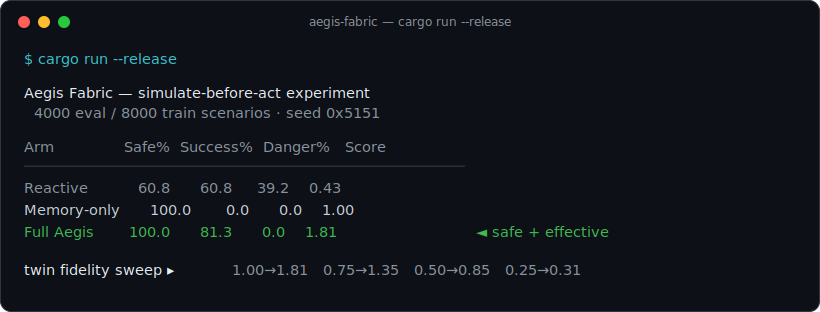

<div align="center">

# Aegis Fabric

### For fleets that must recover before anyone arrives.

Operational memory for autonomous fleets. When a failure cascades through a robot fleet, Aegis Fabric remembers it, **simulates every candidate fix against a calibrated twin before touching the real world**, and applies the safest one — then keeps the lesson. The thesis is settled by one reproducible experiment: simulate-before-act reaches **100% safe recovery** where a reactive runbook reaches 61%.

[](docs/STATUS.md)
[](#the-result)
[](#the-result)
[](#)
[](#proof-not-vibes)
[](#license)

<br/>



</div>

> Built for machines in the field: a warehouse fleet at 3am, an edge node behind a flaky link, a robot with no technician nearby. When one fault starts a cascade, Aegis Fabric reconstructs the cause, simulates the repairs, and picks the one that is both safe and effective — and proves, across 4,000 seeded incidents, that doing so beats reacting.

<table align="center">
<tr>
<td align="center"><strong>100.0%</strong><br/>safe recovery</td>
<td align="center"><strong>81.3%</strong><br/>mission success</td>
<td align="center"><strong>0</strong><br/>dangerous actions</td>
<td align="center"><strong>0</strong><br/>dependencies</td>
<td align="center"><strong>1</strong><br/><code>u64</code> seed replays it</td>
</tr>
</table>

---

## See it prove itself

The image above is real output. `cargo run --release` re-runs 4,000 seeded incidents across all three strategies and prints the table live. Every scenario is deterministic — driven by one `u64` seed against the world — so the numbers regenerate exactly from this commit, and any incident replays bit-for-bit.

```bash
cargo run --release            # 4000 eval / 8000 train scenarios
cargo run --release -- 20000   # more scenarios, tighter estimates
```

## The result

The decision problem is a causal cascade, not three random failures: a shared charger faults → robot **A** drains → A drops the **beacon** → robot **B** (which localizes off A's beacon) starts drifting → the fleet degrades. At the moment B starts drifting, each strategy picks **one** recovery action.

| Strategy | Safe% | Success% | Danger% | Score | What it does |
|---|--:|--:|--:|--:|---|
| Reactive | 60.8 | 60.8 | 39.2 | 0.43 | fixed runbook rule, no memory, no simulation |
| Memory-only | 100.0 | 0.0 | 0.0 | 1.00 | best *historical* action — learns, can't adapt |
| **Full Aegis** | **100.0** | **81.3** | **0.0** | **1.81** | simulate every allowed fix, pick the safest viable |

Memory buys you *safety* — it learns the safe default (halt the robot). Simulation buys you safety **and** effectiveness: full mission recovery at zero dangerous actions, because it tests the context-specific fix before committing to it.

And the win is **not** a perfect-oracle artifact. The twin runs on a deliberately-noisy *belief* of the world with a fidelity knob. As fidelity drops, simulate-before-act degrades gracefully — and below ~0.5 it stops being worth it. That threshold is the honest research frontier, not a number to hide.

| Twin fidelity | 1.00 | 0.90 | 0.75 | 0.50 | 0.25 |
|---|--:|--:|--:|--:|--:|
| Safe% | 100.0 | 95.1 | 88.8 | 76.5 | 63.0 |
| Score | 1.81 | 1.61 | 1.35 | 0.85 | 0.31 |

## What it is

Aegis Fabric is an **operational-memory runtime** for autonomous fleets: it records every meaningful event into an append-only log, projects that log into a live world model, diagnoses failure, simulates candidate repairs against a calibrated twin, and applies the safest policy-allowed one — keeping every outcome so the next incident is easier.

It is **not** a dashboard, not a SaaS wrapper, not a generic AI-agent framework. It is a runtime for remembering failure and recovering safely. The full thesis, the seven core laws, and the layered architecture are in [docs/scope.md](docs/scope.md).

This repo is the **MVP wedge**: a simulated fleet that proves the loop end-to-end on one causal incident. What it deliberately does *not* yet solve is stated plainly in [Honest scoping](#honest-scoping).

## What's inside

| | |
|---|---|
| **Ground-truth world** | the charger→battery→beacon→localization cascade on a shared, deterministic tick engine ([`sim.rs`](src/sim.rs)) |
| **The twin** | the *same* dynamics run on a noisy *belief* of the world, with a fidelity knob — a separate input path, so "simulation helps" can't be a tautology |
| **Operational memory** | per-symptom action outcomes; the compounding lesson store ([`decision.rs`](src/decision.rs)) |
| **Policy gate** | forbids high-risk actions in context (e.g. restart the beacon anchor while B is moving) |
| **Three strategies** | Reactive, Memory-only, Full Aegis — behind one `decide()` |
| **The experiment** | trains memory, evaluates all three on identical seeded incidents, prints the table, the fidelity sweep, and a narrated incident ([`experiment.rs`](src/experiment.rs)) |

## Proof, not vibes

The claim is not asserted, it is measured, and the measurement regenerates:

- **Deterministic simulation.** Every incident is one `u64` seed against the world, so any result replays exactly. 4,000 seeded incidents per strategy, on *identical* scenarios, for a fair paired comparison.
- **A separated twin.** The decider never sees ground truth — only a fidelity-controlled belief. The fidelity sweep proves the advantage is real and bounded, not an oracle predicting itself.
- **An honest baseline ablation.** Three arms isolate the two effects: Reactive → Memory-only measures what *remembering* buys; Memory-only → Full Aegis measures what *simulating* buys on top.
- **A causal demo, narrated.** One incident printed end-to-end: the cascade if nothing is done, then each strategy's choice and outcome.

```bash
cargo run --release            # the table, the fidelity sweep, and the narrated incident
```

## Architecture

```text
   seeded scenario ─▶ ground-truth world  (charger ▸ battery ▸ beacon ▸ localization)
                              │ emits events to the append-only log
                              ▼
   decision point ─▶ observe ▸ noisy belief ─▶ TWIN  (same dynamics, fidelity knob)
                              │                    │ simulate every policy-allowed action
                              ▼                    ▼
        policy gate ◀──── deciders ▸ Reactive · Memory-only · Full Aegis
                              │ safest viable action
                              ▼
        apply to world ─▶ verify ─▶ score (safe / success / MTTR) ─▶ memory
```

## Honest scoping

The MVP proves the loop. By design it does **not** yet solve:

- real-world twin calibration (here the twin is a faithful-enough model by construction),
- causal inference from noisy, distributed, partially-observable signals,
- multi-step remediation (it picks one action per incident),
- real hardware, enterprise hardening, security/compliance.

Those are the frontier, tracked honestly in [docs/STATUS.md](docs/STATUS.md). Naming what isn't solved is the point — a green check that never ran is worth nothing.

## Docs

| | |
|---|---|
| [docs/STATUS.md](docs/STATUS.md) | what's built, what's tested, and what's still ahead — the living tracker |
| [docs/scope.md](docs/scope.md) | the full thesis, the seven core laws, and the layered architecture |
| [CLAUDE.md](CLAUDE.md) | working agreement and project memory for anyone (or any agent) picking this up |

## License

[MIT](LICENSE).
