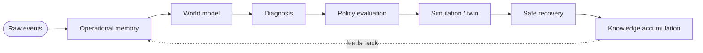

<div align="center">

# 🛡️ Aegis Fabric

### Operational memory for autonomous fleets

**Remember failures · Replay incidents · Simulate interventions · Recover safely**

<br/>

[](LICENSE)
[](#roadmap)
[](#)
[](https://github.com/nathan-luckock/aegis-fabric/stargazers)

**Built with**

[](#)
[](#)
[](#)

</div>

---

Aegis Fabric is an operational memory runtime for autonomous fleets.

It helps robot fleets and edge infrastructure:
- remember failures,
- replay incidents,
- simulate interventions,
- enforce policy before action,
- and recover safely while accumulating operational knowledge over time.

The first wedge is robot fleets and edge nodes.

---

## The thesis

Autonomous systems fail in ways that are distributed, partial, noisy, and hard to debug.

Today, the stack is fragmented:
- observability tools monitor symptoms,
- fleet managers coordinate devices,
- digital twins simulate parts of the system,
- and runbooks handle recovery.

Aegis Fabric unifies the core recovery loop into one runtime:

**raw events → operational memory → world model → diagnosis → policy evaluation → simulation → safe recovery → knowledge accumulation**

The result is a memory layer that lets machines remember what happened, reason about what caused it, and recover more safely over time.

---

## What this is

Aegis Fabric is:
- an operational memory system,
- a deterministic replay runtime,
- a calibrated twin for recovery planning,
- a policy-gated remediation engine,
- and a learning loop for incident history.

It is not a dashboard.
It is not a SaaS wrapper.
It is not a generic AI agent framework.

It is a runtime for operational memory and safe recovery.

---

## The wedge

The first version should solve one specific problem:

**A simulated fleet of machines can remember failures, replay incidents, and safely recover using prior incident history.**

That is the smallest version that proves the full thesis.

Why this wedge:
- failures are real and frequent,
- state is complex but bounded,
- simulation is useful,
- replay matters,
- and recovery can be measured.

---

## The core laws

These are the rules of the system:

1. Every meaningful event is recorded.
2. Every recovery action is explained.
3. Nothing acts before policy evaluation and simulation, unless explicitly allowed.
4. Every failure improves the system's future decisions.
5. Every state must be replayable.
6. Every important entity keeps identity across restarts, migrations, and replacements.
7. Every action is auditable.

---

## The system loop

The runtime follows one closed loop:



In sequence:

1. Ingest events.
2. Update memory.
3. Project a world model.
4. Diagnose the issue.
5. Evaluate policy constraints.
6. Simulate candidate interventions.
7. Choose the safest acceptable action.
8. Execute the recovery.
9. Verify the result.
10. Store the incident forever.
11. Accumulate operational knowledge.

This loop is the heart of the project.

---

## Architecture

### 1) Ingestion
Collect:
- telemetry,
- logs,
- metrics,
- traces,
- robot state,
- config changes,
- operator actions,
- and incident events.

Requirements:
- schema-aware,
- replayable,
- source-identifiable,
- low latency,
- and fault tolerant.

### 2) Memory
Store:
- append-only event history,
- entity identity,
- causal links,
- incident timelines,
- and action outcomes.

This is the source of truth.

### 3) World model
Project memory into current state:
- active assets,
- dependencies,
- topology,
- health,
- task assignment,
- and failure domains.

### 4) Diagnosis
Infer:
- anomalies,
- likely root causes,
- blast radius,
- and candidate explanations.

### 5) Policy evaluation
Decide whether an action is allowed:
- risk limits,
- approval rules,
- ownership,
- safety constraints,
- and rollback conditions.

### 6) Simulation / twin
Test candidate interventions before acting.

The twin is a **calibrated decision environment**, not a perfect copy of reality.

### 7) Remediation
Execute safe recovery:
- restart,
- reroute,
- isolate,
- reschedule,
- degrade,
- or request human approval.

### 8) Knowledge accumulation
Store outcomes and improve future decisions.

---

## What the twin is and is not

The twin is not a magical perfect simulator.

It is:
- a faithful-enough environment for the wedge,
- a tool for bounded decision-making,
- and a risk filter before action.

For the MVP, the twin is controlled by the same team that builds the runtime, so it is faithful enough to prove the loop, but it does not solve real-world twin calibration, noisy causal inference, or partial observability at scale.

Those are the research frontier, not the initial wedge.

---

## Why unification wins

A fleet manager, a replay system, a twin, and a remediation engine can exist separately.

Aegis Fabric unifies them because they share the same primitives:
- event ordering,
- identity,
- replay,
- causal links,
- and policy.

If those primitives are shared, the system becomes coherent instead of fragmented.

That is why the architecture is defensible.

---

## MVP scope

The MVP should include only these four layers:

1. Ingest
2. Memory
3. Replay
4. Twin + one remediation loop

Everything else is later.

No full SDK ecosystem yet.
No broad multi-domain expansion yet.
No autonomous general remediation yet.

The MVP must prove one thing:

**simulate-before-act improves recovery compared to a reactive baseline.**

---

## Falsifiable experiment

This project must ship with a measurable experiment.

### Baseline
Reactive runbook:
- apply the first matching recovery rule without simulation.

### Aegis Fabric
- ingest event,
- update memory,
- diagnose,
- evaluate policy,
- simulate candidate fixes,
- choose the safest action,
- execute,
- verify,
- record result.

### Metrics
For N injected failure scenarios, measure:
- successful recovery rate,
- safe recovery rate,
- dangerous actions avoided,
- mean time to recovery.

### Arms
1. Reactive.
2. Memory-only.
3. Full Aegis.

This separates the contribution of memory from the contribution of simulation.

### Example goal
Across 100 scenarios:
- Full Aegis should outperform Reactive on safety and recovery.
- Full Aegis should outperform Memory-only if simulation is adding value.
- Full Aegis should avoid actions the baseline would have taken when the twin flags risk.

The exact numbers can change, but the experiment must exist.

---

## Running the experiment

The MVP is built — Rust, zero dependencies, fully deterministic (every scenario
replays bit-for-bit from its seed).

```bash
cargo run --release            # defaults: 4000 eval / 8000 train scenarios
cargo run --release -- 20000   # more scenarios for tighter estimates
```

Sample result (seed `0x5151`, 4000 evaluation scenarios):

| Arm | Safe% | Success% | Danger% | Score |
|-----|------:|---------:|--------:|------:|
| Reactive | 60.8 | 60.8 | 39.2 | 0.43 |
| Memory-only | 100.0 | 0.0 | 0.0 | 1.00 |
| **Full Aegis** | **100.0** | **81.3** | **0.0** | **1.81** |

Memory buys *safety* (it learns the safe default). Simulation buys safety **and**
effectiveness — full mission recovery at zero dangerous actions.

**Twin-fidelity sweep** (Full Aegis) — proving the win is not a perfect-oracle artifact:

| Fidelity | Safe% | Success% | Score |
|---------:|------:|---------:|------:|
| 1.00 | 100.0 | 81.3 | 1.81 |
| 0.75 | 88.8 | 69.0 | 1.35 |
| 0.50 | 76.5 | 55.7 | 0.85 |
| 0.25 | 63.0 | 42.1 | 0.31 |

As the twin degrades, simulate-before-act degrades gracefully — and below ~0.5
fidelity it stops being worth it. That threshold is the honest research frontier.

---

## Demo scenario

Use a causal failure spine, not three random failures.

Example:
- Shared charger faults.
- Robot A battery drains.
- Robot A drops out of the beacon network.
- Robot B depends on A's beacon and loses localization.
- The fleet starts degrading.

This is good because:
- there is a real causal chain,
- the memory graph has something to reconstruct,
- the twin has something non-trivial to simulate,
- and the remediation is meaningful.

### Demo flow
1. Start a simulated fleet.
2. Inject a shared charger fault.
3. Watch the failure cascade.
4. Show memory graph updates.
5. Show diagnosis.
6. Simulate 2–3 interventions.
7. Apply the safest policy-approved recovery.
8. Replay the incident.
9. Save the incident forever.

---

## What is deferred

Be explicit about what the MVP does not solve:
- Real-world twin calibration.
- Causal inference from noisy distributed signals.
- Full multi-domain support.
- Autonomous remediation without policy gating.
- Enterprise hardening.
- Production security and compliance.
- Large SDK and plugin ecosystem.

That honesty makes the project stronger.

---

## Repository structure

Suggested layout:

- `core/` — event model, identities, state model
- `ingest/` — collectors and adapters
- `memory/` — causal memory and storage
- `replay/` — deterministic replay and forensics
- `twin/` — simulation and counterfactuals
- `diagnosis/` — anomaly detection and root cause inference
- `policy/` — action constraints and approvals
- `remediation/` — recovery workflows
- `console/` — operator UI
- `examples/` — demo scenarios
- `docs/` — architecture, laws, roadmap

---

## Roadmap

### Phase 0 — Define the thesis
- Choose the wedge.
- Define the laws.
- Define the event schema.
- Design the causal demo.
- Define safe and dangerous actions.

### Phase 1 — Memory
- Build ingest.
- Persist event history.
- Track entity identity.
- Store incident timelines.

### Phase 2 — Replay
- Reconstruct historical incidents.
- Show deterministic replay.
- Add a timeline viewer.

### Phase 3 — Diagnosis
- Detect failure patterns.
- Infer likely causes.
- Rank candidate explanations.

### Phase 4 — Twin
- Simulate candidate interventions.
- Compare recovery options.
- Reject risky actions.

### Phase 5 — Controlled remediation
- Apply one safe recovery workflow.
- Verify outcome.
- Store the result.

### Phase 6 — Knowledge accumulation
- Improve recovery ranking.
- Store prior incidents.
- Reuse memory in future runs.

### Phase 7 — Expansion
- Add more fleet types.
- Add real hardware pilots.
- Add additional safety policy surfaces.

---

## Company version

If this becomes a company, the product should be framed as:

**Aegis Fabric gives autonomous fleets long-term operational memory, replay, and safe recovery.**

That is the commercial wedge.

Potential customers:
- warehouse robotics teams,
- industrial automation teams,
- drone fleet operators,
- edge infrastructure teams,
- and other mission-critical autonomous operators.

The open-source project builds trust and adoption.
The commercial product can later add:
- hosted deployment,
- enterprise policy controls,
- multi-site memory sync,
- advanced replay,
- and support.

---

## Why this can become a real business

This can be profitable because it solves expensive operational pain:
- downtime,
- incident duration,
- repeated failures,
- and unsafe recovery.

The business value is not the vision.
The business value is that it makes machine operations more reliable and easier to debug.

That is worth paying for.

---

## Final definition

Aegis Fabric is an operational memory runtime for autonomous systems.

It remembers failures.
It replays incidents.
It simulates interventions.
It executes policy-constrained recovery.
It accumulates operational knowledge over time.

That is the project.
