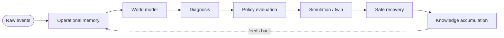

# Aegis Fabric — scope

The full thesis, the core laws, and the layered architecture.

[Overview](../README.md) &nbsp;·&nbsp; [Status](STATUS.md) &nbsp;·&nbsp; [Working agreement](../CLAUDE.md)

---

## Operational memory for autonomous fleets

Aegis Fabric is an operational memory runtime for autonomous fleets.

It helps robot fleets and edge infrastructure:
- remember failures,
- replay incidents,
- simulate interventions,
- enforce policy before action,
- and recover safely while accumulating operational knowledge over time.

The first wedge is robot fleets and edge nodes.

---

## The thesis

Autonomous systems fail in ways that are distributed, partial, noisy, and hard to debug.

Today, the stack is fragmented:
- observability tools monitor symptoms,
- fleet managers coordinate devices,
- digital twins simulate parts of the system,
- and runbooks handle recovery.

Aegis Fabric unifies the core recovery loop into one runtime:

**raw events → operational memory → world model → diagnosis → policy evaluation → simulation → safe recovery → knowledge accumulation**

The result is a memory layer that lets machines remember what happened, reason about what caused it, and recover more safely over time.

---

## What this is

Aegis Fabric is:
- an operational memory system,
- a deterministic replay runtime,
- a calibrated twin for recovery planning,
- a policy-gated remediation engine,
- and a learning loop for incident history.

It is not a dashboard.
It is not a SaaS wrapper.
It is not a generic AI agent framework.

It is a runtime for operational memory and safe recovery.

---

## The wedge

The first version solves one specific problem:

**A simulated fleet of machines can remember failures, replay incidents, and safely recover using prior incident history.**

That is the smallest version that proves the full thesis.

Why this wedge:
- failures are real and frequent,
- state is complex but bounded,
- simulation is useful,
- replay matters,
- and recovery can be measured.

---

## The core laws

These are the rules of the system:

1. Every meaningful event is recorded.
2. Every recovery action is explained.
3. Nothing acts before policy evaluation and simulation, unless explicitly allowed.
4. Every failure improves the system's future decisions.
5. Every state must be replayable.
6. Every important entity keeps identity across restarts, migrations, and replacements.
7. Every action is auditable.

---

## The system loop

The runtime follows one closed loop:

In sequence:

1. Ingest events.
2. Update memory.
3. Project a world model.
4. Diagnose the issue.
5. Evaluate policy constraints.
6. Simulate candidate interventions.
7. Choose the safest acceptable action.
8. Execute the recovery.
9. Verify the result.
10. Store the incident forever.
11. Accumulate operational knowledge.

This loop is the heart of the project.

---

## Architecture

### 1) Ingestion
Collect telemetry, logs, metrics, traces, robot state, config changes, operator
actions, and incident events. Requirements: schema-aware, replayable,
source-identifiable, low latency, fault tolerant.

### 2) Memory
Store append-only event history, entity identity, causal links, incident
timelines, and action outcomes. This is the source of truth.

### 3) World model
Project memory into current state: active assets, dependencies, topology,
health, task assignment, and failure domains.

### 4) Diagnosis
Infer anomalies, likely root causes, blast radius, and candidate explanations.

### 5) Policy evaluation
Decide whether an action is allowed: risk limits, approval rules, ownership,
safety constraints, and rollback conditions.

### 6) Simulation / twin
Test candidate interventions before acting. The twin is a **calibrated decision
environment**, not a perfect copy of reality.

### 7) Remediation
Execute safe recovery: restart, reroute, isolate, reschedule, degrade, or
request human approval.

### 8) Knowledge accumulation
Store outcomes and improve future decisions.

---

## What the twin is and is not

The twin is not a magical perfect simulator. It is a faithful-enough environment
for the wedge, a tool for bounded decision-making, and a risk filter before
action.

For the MVP, the twin is controlled by the same team that builds the runtime, so
it is faithful enough to prove the loop — but it does not solve real-world twin
calibration, noisy causal inference, or partial observability at scale. Those are
the research frontier, not the initial wedge.

**Anti-circularity rule.** In code, the twin must remain a *separate,
intentionally-imperfect* model of the ground-truth world: it runs on a noisy
*belief* with a fidelity knob, never on ground truth itself. If the twin becomes
the simulator, "simulate-before-act helps" is a tautology, not a result. See
[STATUS.md](STATUS.md) for how the experiment enforces this.

---

## Why unification wins

A fleet manager, a replay system, a twin, and a remediation engine can exist
separately. Aegis Fabric unifies them because they share the same primitives:
event ordering, identity, replay, causal links, and policy. If those primitives
are shared, the system becomes coherent instead of fragmented. That is why the
architecture is defensible.

---

## The falsifiable experiment

This project ships with a measurable experiment.

- **Baseline (Reactive):** apply the first matching recovery rule without simulation.
- **Aegis:** ingest → memory → diagnose → policy → simulate → safest action → verify → record.
- **Arms:** Reactive, Memory-only, Full Aegis — to separate the contribution of
  memory from the contribution of simulation.
- **Metrics:** safe recovery rate, successful recovery rate, dangerous actions, MTTR.

Goal: Full Aegis outperforms Reactive on safety and recovery, and outperforms
Memory-only when simulation is adding value. The exact numbers can change, but
the experiment must exist. Current results are in [STATUS.md](STATUS.md) and the
[README](../README.md).

---

## Demo scenario

A causal failure spine, not three random failures:

- Shared charger faults.
- Robot A battery drains.
- Robot A drops out of the beacon network.
- Robot B depends on A's beacon and loses localization.
- The fleet starts degrading.

This is good because there is a real causal chain, the memory graph has something
to reconstruct, the twin has something non-trivial to simulate, and the
remediation is meaningful.

---

## Repository structure

The MVP keeps the surface small; the layout grows toward this shape:

- `src/` — the runtime (event model, sim, twin, memory, policy, deciders, experiment)
- `docs/` — scope, status, design notes
- planned: `core/`, `ingest/`, `memory/`, `replay/`, `twin/`, `diagnosis/`, `policy/`, `remediation/`, `console/`

---

## Company version

If this becomes a company, the product is framed as: **Aegis Fabric gives
autonomous fleets long-term operational memory, replay, and safe recovery.**

Potential customers: warehouse robotics teams, industrial automation teams, drone
fleet operators, edge infrastructure teams, and other mission-critical autonomous
operators. The open-source project builds trust and adoption; the commercial
product can later add hosted deployment, enterprise policy controls, multi-site
memory sync, advanced replay, and support.

---

## Final definition

Aegis Fabric is an operational memory runtime for autonomous systems.

It remembers failures.
It replays incidents.
It simulates interventions.
It executes policy-constrained recovery.
It accumulates operational knowledge over time.

That is the project.
